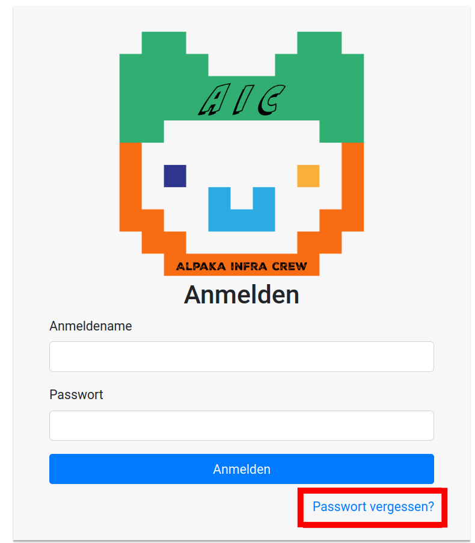
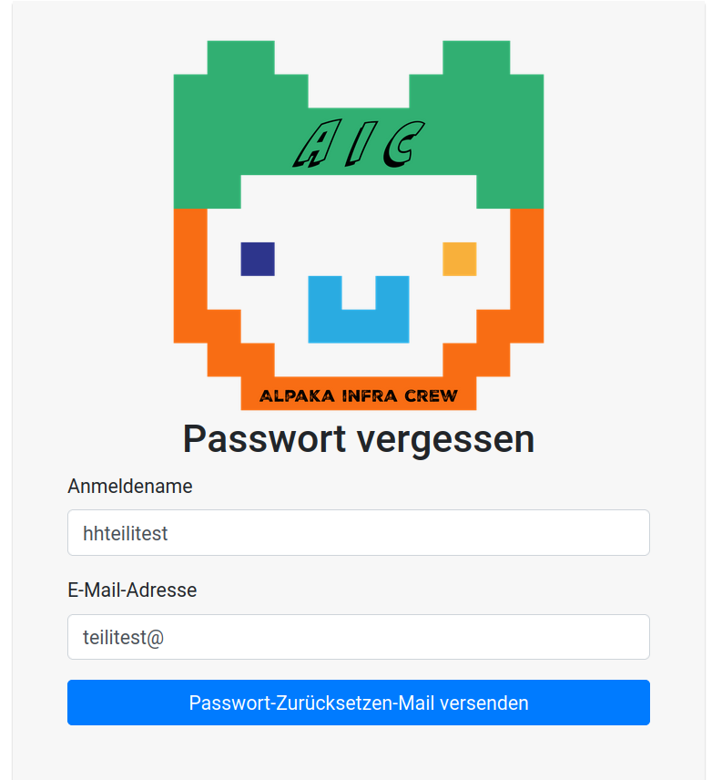
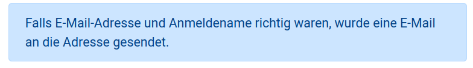
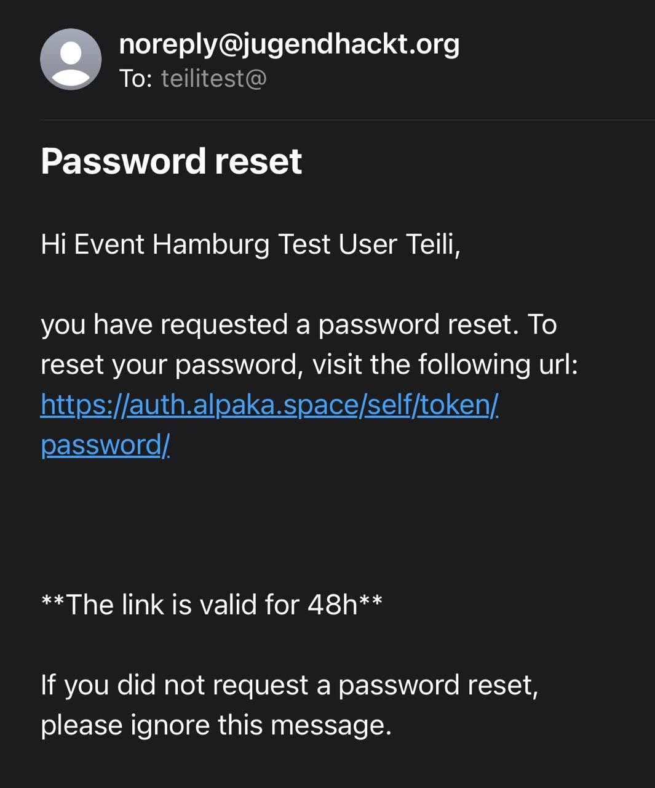
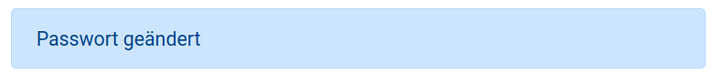

AlpakaSSO - Passwort vergessen
===

Wenn du bereits einen AlpakaAuth Account (auch SSO Account genannt) besitzt, du aber dein Passwort nicht mehr weißt oder ein falsches in deinem Passwort Manager hinterlegt ist, kannst du dein Passwort erneuern. 

Dafür brauchst du dein Anmeldenamen *(das ist der, den du nicht mehr ändern kannst, nicht der, den andere sehen)* und eine E-mail-Adresse, die in deinem Account hinterlegt ist. Das ist wahrscheinlich die E-Mail-Adresse, mit der du dich das erste mal registriert hast.

{width=300}

Im Anmeldemenü findest du unter dem Anmelden Button ein **Passwort vergessen** Button, wenn du auf den klickst, kommst du zur Passwort zurücksetzen Ansicht.  

{width=300}

Dort kannst du dein Anmeldenamen und deine E-Mail Adresse eintragen. Wenn beides eingetragen ist, klickst du auf den "Passwort-Zurücksetzen-Mail versenden" Button.

!!! note "Hinweis"
    Wenn du dich an Anmeldenamen und E-Mail nicht mehr erinnern kannst, frage eine\*n Mentor\*in oder die Orga um hilfe.

{width=300}

Unabhängig davon, ob Anmeldename und E-Mail existieren und korrekt geschrieben sind, erscheint eine hellblaue Meldung, dass eine E-Mail gesendet wurde.
Erhälst du nach einigen Minuten keine E-Mail an die angegebene E-Mail Adresse schaue noch einmal im *Spam* bzw. *Junk* Ordner nach und überprüfe ob du Anmeldenamen und E-Mail-Adresse korrekt geschrieben hast.

!!! note "Hinweis"
    Dein Anmeldenamen kann nur Zahlen und Kleinbuchstaben enthalten. Setzt dein hany zum Beispiel den ersten Buchstaben in einem Feld groß, musst du das korrigieren.

{width=300}

Sind beide Angaben korrekt und ein Account mit deinem Anmeldenamen und zugehöriger E-Mail registriert erhälst du eine E-Mail von "noreply@jugendhackt."org" mit dem Betreff **Password reset**.
Die E-Mail ist auf Englisch und ein Link, der mit "https://auth.alpaka.space/self/token/password/" beginnt, erlaubt dir dein Passwort innerhalb der nächsten zwei Tage zurück zu setzen. Schaffst du es in der Zeit nicht, musst du dir erneut unter "Passwort vergessen" eine E-Mail zusenden lassen.

Nachdem du auf den Link geklickst hast, kannst du ein neues Passwort setzen.
Auch bei deinem neuen Passwort, gelten die Regeln, dass es  mindestens 8 Zeichen lang sein muss, du Groß- und Kleinbuchstaben verwenden solltest, sowie Ziffern und verschiedene Sonderzeichen. 
Ä, Ö, Ü und andere Umlautbuchstaben wie Ñ funktionieren nicht. Auch nicht als Kleinbuchstaben :D.
Falls du einen Passwort-Manager hast, lass dir ein Passwort generieren. Falls du keinen hast, aber gerne wüsstest, was das ist, frag in den kommenden Tagen gerne eine\*n Mentor\*in.

{width=300}

Wenn du dein neues Passwort zwei mal identisch eingegeben hast, kannst du es mit dem **Passwort zurücksetzen** Button bestätigen. Eine hellblaue Bestätigungsmeldung taucht auf und dir wird automatisch die Anmeldemaske gezeigt. 
Du kannst dich mit deinem neuen Passwort und deinem Anmeldenamen direkt einloggen. 