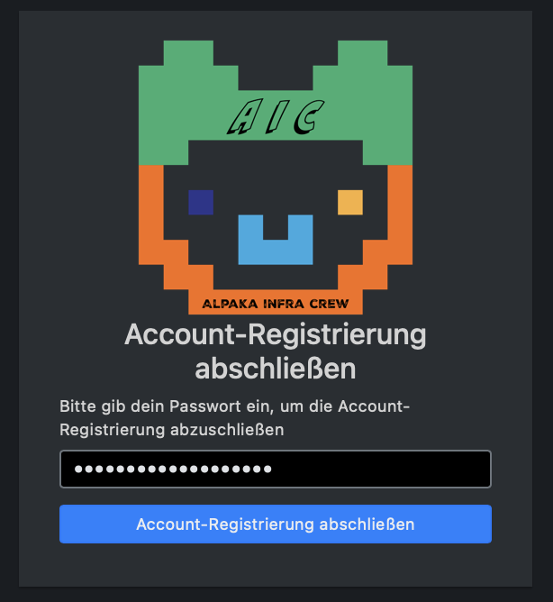

AlpakaSSO / uffd
===

**Wilkommen bei Jugend hackt!**

Egal ob auf einem Event oder im Lab, wir haben verschiedene Tools beziehungsweise Dienste um dir das Zusammenarbeiten, Basteln, oder auch Planen, so einfach wie möglich zu machen.

Damit du dir nicht viele verschiedene Accounts und Passwörter merken musst, gibt es ein Zentrales Anmeldesystem. Das wird auch Single Sign On oder SSO genannt. Du wirst das immer wieder finden. Vielleicht auch unter einem der folgenden Namen: *Jugend hackt SSO*, *AlpakaSSO*, *AlpakaAuth*, *SSO*, *Single-Sign-On*, *uffd*, *OIDC*, *OAUTH(2)*
Für diese Anleitjngen versuchen wir bei *SSO* und *AlpakaAuth* zu bleiben.
Wenn du dich in dem System angemeldet hast, kannst du dadurch auf die meisten weiteren Tools zugreifen, die du im Lab oder auf einem Event benutzen wirst.

!!! note "Hinweis"
    Falls du noch keinen Link bekommen hast, um dich anzumelden, können dir die Mentor\*innen oder Orga weiterhelfen. Oft gibt es ein QR Code, den du abscannen kannst.

Wenn du den Link geöffnet hast, erscheint dir ein buntes Alpaka unter dem **Einladungslink** steht.
Du hast zwei Optionen. Entweder einen neuen Account zu regestrieren, oder die Gruppe deinem Account hinzuzufügen.

{width=300}

Wenn du dir bereits einen Account angelegt hast, zum Beispiel, weil du bereits auf einem anderen Event warst, kannst du dich durch diesen Link einer neuen Gruppe hinzufügen. *Du musst keinen neuen Account anlegen*.
Dafür klickst du auf den Button **Anmelden und die Rollen zu deinem Account hinzufügen**. Nachdem du dich mit deinem Anmeldenamen und Passwort angemeldet hast, bist du automatisch in den neuen Gruppen des Events oder Labs.
Hast du dein Passwort vergessen, kannst du es entweder selbstständig unter https://auth.alpaka.space/self/passwordreset zurücksetzen, oder Mentor\*innen sowie Orga um Hilfe fragen. 

!!! note "Passwort zurücksetzen"
    Hast du dein Passwort vergessen, kannst du es entweder selbstständig zurücksetzen [(Anleitung)](/alpakasso/forgot), oder Mentor\*innen sowie Orga um Hilfe fragen. 
Wenn du sicher weißt, dass du noch keinen Account hast, klickst du auf den oberen Button **Neuen Account regestrieren**.

## Registrieren

Du kannst dir nun einen Namen aussuchen, mit dem du dich anmelden möchtest. Das kann dein Name sein, oder ein Spitzname, der dir gefällt. Dieser Name wird nicht von anderen Teilnehmenden gesehen, kann aber auch **NICHT** wieder geändert werden.
Dein Name kann aus Kleinbuchstaben (a-z) bestehen. Außerdem kannst du Zahlen (0-9) verwenden und Bindestriche (-) oder Unterstriche (\_). Was nicht funktioniert sind Großbuchstaben (A-Z) und Sonderzeichen wie \* oder Emojis. Du kannst dich also "cooles_alpaka2" nennen. "CoolesAlpaka:D" funktioniert nicht, da es Großnbuchstaben und Sonderzeichen enthält.

!!! Warning "Einzigartiger Anmeldename"
    Nachdem du einen Anmeldenamen eingegeben hast, kannst du mit dem Button **Überprüfen** kontrollieren, das der Name noch nicht vergeben ist. Wenn der Name grün umrandet wird, kannst du ihn verwenden. Ansonsten musst du dir einen neuen aussuchen.

{width=400}

Danach gibt du in dem Feld "Anzeigename" ein, wie andere deinen Namen sehen wollen. Diesen Namen können auch andere Teilnehmende sehen und du kannst ihn *jederzeit* ändern. Außerdem kannst du hier auch Sonderzeichen und Großbuchstaben verwenden. "Cooles Alpaka" wäre jetzt möglich. Außerdem kannst du den gleichen Anzeigenamen wie jemand anderes haben. Es wäre also kein problem, wenn noch jemand deinen Vornamen hat, ihr den aber beide als euren Anzeigenamen nutzen wollt.

Bei deiner E-Mail-Adresse musst du eine Adresse angeben, auf die du Zugriff hast. Erst nachdem du deine E-Mail bestätigt hast, kannst du auf die verschiedenen Funktionen des SSO (das System für das du dich gerade Registrierst) zugreifen.
Insbesondere wenn du auf einem Event bist und nicht schnell nach Hause kannst, ist es also wichtig eine E-Mail Adresse zu benutzen, die zum Beispiel direkt von deinem Handy abbrufbar ist.
!!! note "Hinweis"
    Falls dir keine E-Mail Adresse zur Verfügung steht, sprich eine Mentor\*in an.

Als letztes brauchst du noch ein Passwort. Damit andere dein Passwort nicht direkt erraten können, solltest du nicht dein Benutzernamen oder dir wichtige Geburtstage oder Telefonnummern benutzen.
Außerdem muss dein Passwort mindestens 8 Zeichen lang sein. Du kannst Groß und Kleinbuchstaben verwenden, Ziffern und verschiedene Sonderzeichen. Ä, Ö, Ü und andere Umlautbuchstaben wie Ñ funktionieren nicht. Auch nicht als Kleinbuchstaben :D.
Falls du einen Passwort-Manager hast, lass dir ein Passwort generieren. *Falls du keinen hast, aber gerne wüsstest, was das ist, frag in den kommenden Tagen gerne eine\*n Mentor\*in.*

Wenn du dein Passwort ein zweites mal eingegeben hast, um sicherzustellen, dass du es dir korrekt gemerkt hast (oder dein Passwort-Manager es sich für dich gemerkt), kannst du auf "Account registrieren" klicken.

Wenn alle Angaben den Vorgaben entsprechen, bekommst du eine Meldung, dass du deine E-Mail-Adresse bestätigen sollst.
Bekommst du diese Meldung nicht, stimmen vielleicht deine Passwörter nicht überein, oder dein Anmeldenamen ist bereits vergeben. Das Feld, in dem du eine Änderung vornehmen musst, ist rot.

{width=400}

Öffne deine E-Mails und schaue nach, ob du eine E-Mail von "noreply@jugendhackt.org" bekommen hast. Der Betreff der E-Mail ist **Confirm your mail address**. Hast du nach mehreren Minuten noch keine E-Mail erhalten, kontrolliere auch dein *Spam* oder *Junk* Ordner. Hast du das Registrierungsfenster noch offen, kontrolliere auch gerne, ob deine E-Mail-Adresse korrekt geschrieben ist.

{width=600}

Die E-Mail ist auf Englisch. In ihr wird bestätigt, dass du einen Account angelegt hast. Der obere Link beginnt mit "https://auth.alpaka.space/signup/confirm" und hat dahinter verschiedene Zahlen. Wenn du auf diesen Link klickst, bestätigst du, dass du  deinen Account registrieren möchtest und Zugriff auf deine E-Mail-Adresse hast.
Sollte der Link nicht mehre funktionieren, hast du wahrscheinlich länger als 48 Stunden zum Bestätigen gebraucht. Dann kannst du den Registrierungslink vom Anfang nutzen, um dich erneut anzumelden.

Nachdem du auf den Link geklickt hast, wirst du gebeten, dein Passwort einzugeben. Wenn du das hier angibst, hast du es geschafft. Dein Account ist Registriert und du hast Zugriff auf die verschiedenen Tools.

{width=400}

**Herzlichen Glückwunsch!** Du bist direkt in allen für die Veranstaltung nötigen Gruppen und kannst die Tools nutzen.

## Tools (Dienste)

Die Tools sind die verschiedenen Kacheln, die du direkt nach der Anmeldung, oder unter dem Reiter "Dienste" siehst. 
In jedem Falle solltest du "Chat", "Wiki", "Git", "Status" und "Pads" sehen. Abhängig von den Gruppen, den du hinzugefügt wurdest, kann es sein dass du mehr Tools siehst. 

{width=600}

Du bist in jedem dieser Tools bereits in den für dich notwendigen Gruppen angemeldet. Wenn du weitere Gruppen brauchst, frag gerne bei Mentor\*innen nach.

!!! note "Hinweis"
    Wenn du möchtest gibt es Anleitungen, wie du dich bei den verschidenen Tools einloggst. Im Wiki werden dir verschiedene Funktionen der Tool noch genauer erklärt *(aktuell noch in Arbeit)*
- **Chat** erlaubt dir auch außerhalb von Zulip mit anderen zu Chatten
- **Pads** erlaubt dir mit anderen gemeinsam an Notizen zu arbeiten, oder über verschiedene Geräte hinweg
- In **Status** kannst du sehen, ob alle Tools aktuell erreichbar sind 
- Wenn die Event Orga Zeiten im **Fahrplan** eingetragen hat, kannst du dort nachsehen, wann was stattfindet
- Mithilfe von **Termimverwaltung** kanst du verschiedene Terminoptionen mit anderen abstimmen

## Einstellungen (Selfservice)

{width=300}

Unter dem zweiten Reiter in der grauen, oberen Zeile, Selfservice, kannst du 
- deinen Anzeigenamen ändern
- deine E-Mail adresse ändern
- dein Passwort ändern
- Zwei Faktor Authentifizierung einstellen, um andere daran zu hindern, sich mit deinem Anmeldenamen und Passwort anzumelden
- aus Gruppen austreten
- sehen mit welchen Geräten du dich angemeldet hast

## Abmelden und Ansicht
In der grauen, oberen Zeile gibt es außerdem die Möglichkeit die Ansicht von Mobil (Handy ansicht) auf Desktop (Computer Bildschirm ansicht) hin und her zu wechseln. 
Außerdem kannst du dich abmelden, wenn du für den Moment kein Zugriff merh auf deinen Account brauchst.

{width=300}

