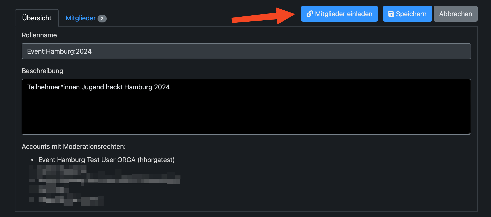
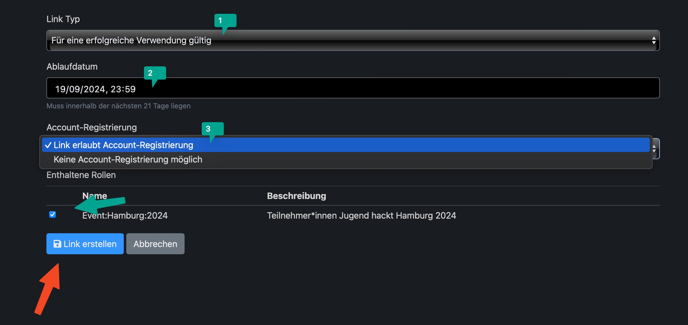
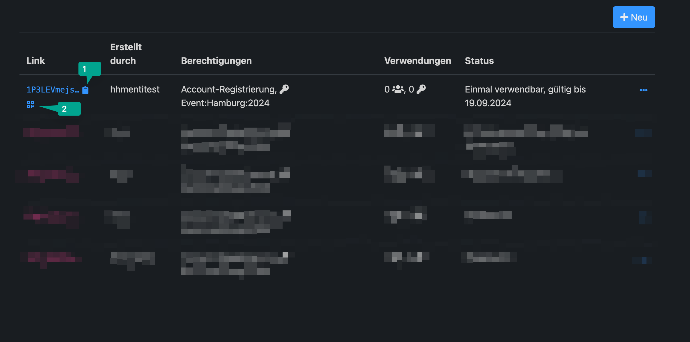
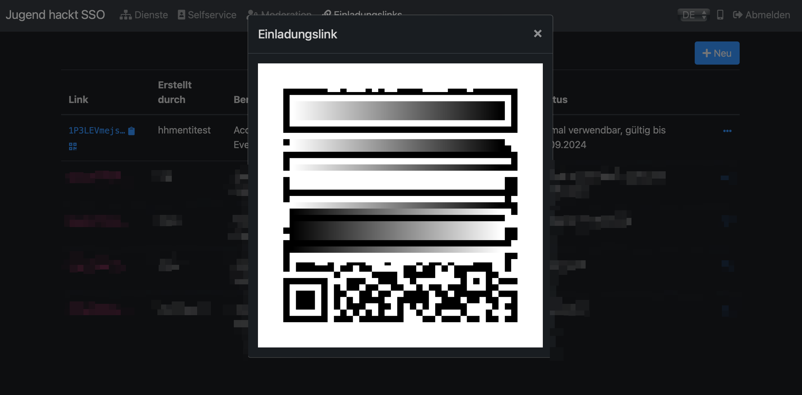
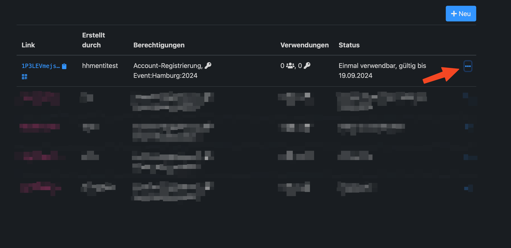
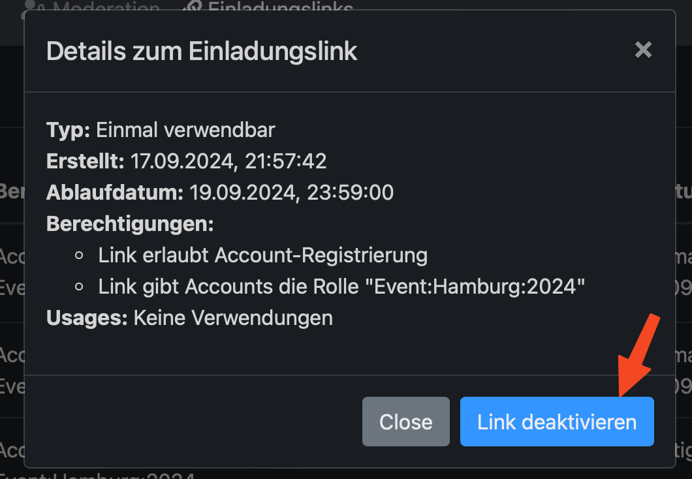

AlpakaSSO - Moderieren - User zu Gruppe hinzufügen
===

Um Nutzende zu einer Gruppe hinzuzufügen, brauchst du Moderationsrechte. Dann wird dir der Reiter Moderation in der grauen Leiste angezeigt.
Klick auf Moderation

{width=300} 

Klick auf das Event

{width=300}

Auf Mitglieder hinzufügen

{width=300}

Noch einmal die korrekte Gruppe bestätigen und überprüfen ob die Link dauer korrekt ist.

{width=300}

Unter Einladungslinks ist der neu generierte Link jetzt sichtbar

{width=300}

Es kann direkt ein QR Code angezeigt werden, oder mit dem Clipboard daneben, der Link kopiert werden.

{width=300}

#### Link Deaktivieren

Um den Link zu deaktivieren, links auf die drei Punkt eklicken

{width=300}

das deakticieren bestätigen

{width=300}

