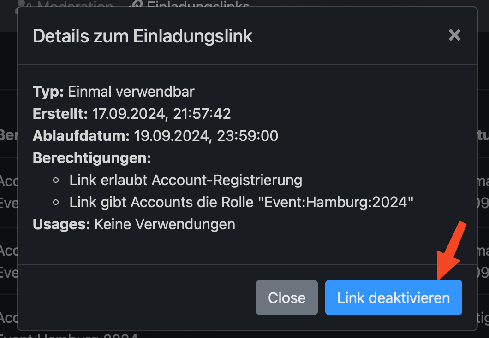

AlpakaSSO - Moderieren - Neue User einladen
===

Auf den Reiter Einladungslink klicken

{width=300}

Dort auf den Button +Neu

{width=300}

Der neu generierte Link jetzt sichtbar

{width=300}

Es kann direkt ein QR Code angezeigt werden, oder mit dem Clipboard daneben, der Link kopiert werden.

{width=300}

#### Link Deaktivieren

Um den Link zu deaktivieren, links auf die drei Punkte klicken

{width=300}

das deakticieren bestätigen

{width=300}