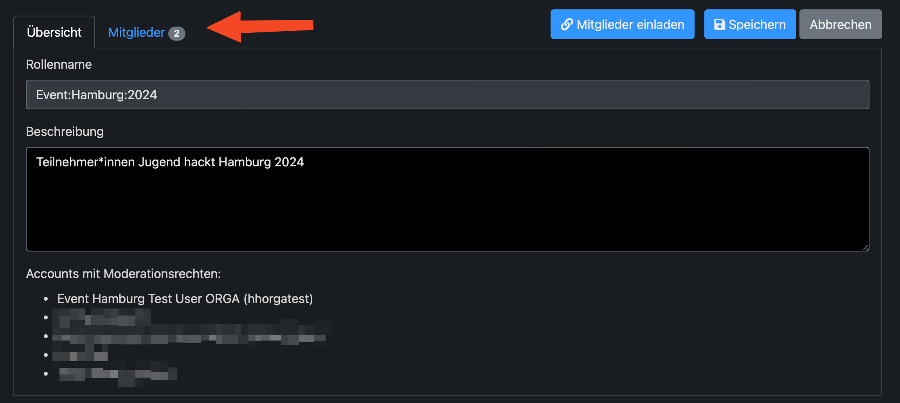
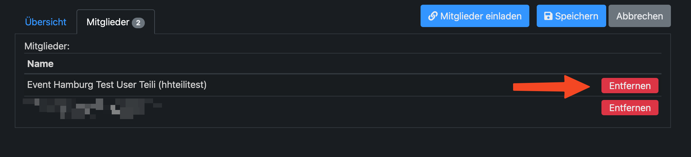

AlpakaSSO - Moderieren - User aus Gruppe entfernen
===

Um Nutzende zu einer Gruppe hinzuzufügen, brauchst du Moderationsrechte. Dann wird dir der Reiter Moderation in der grauen Leiste angezeigt.
Klick auf Moderation.

{width=300}

Das Event auswáhlen 

{width=300}

Dort Mitglieder auswählen

{width=300}

Beim betreffenden Nutzenden auf **Entfernen** klicken 

{width=300}
S