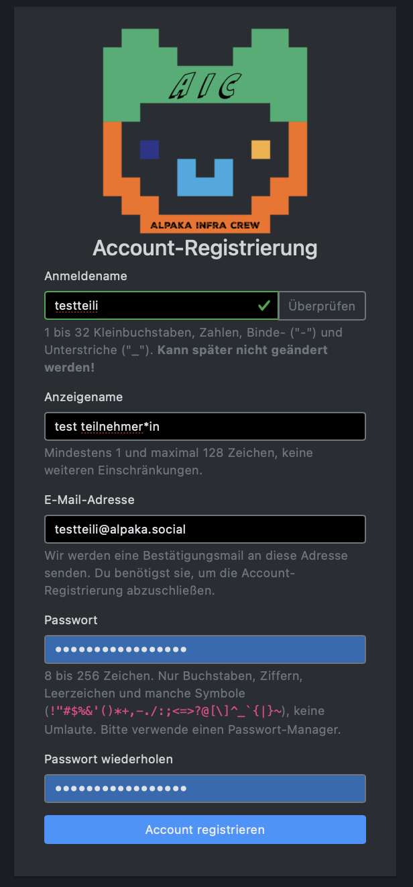

AlpakaSSO - Registrieren
===
 Zum Registrieren brauchst du einen Einladungslink. Frag gerne bei den Mentor\*innen oder der Orga nach, wenn du noch keinen erhalten hast.
 

Du kannst dir nun einen Namen aussuchen, mit dem du dich anmelden möchtest. Das kann dein Name sein, oder ein Spitzname, der dir gefällt. Dieser Name wird nicht von anderen Teilnehmenden gesehen, kann aber auch **NICHT** wieder geändert werden.
Dein Name kann aus Kleinbuchstaben (a-z) bestehen. Außerdem kannst du Zahlen (0-9) verwenden und Bindestriche (-) oder Unterstriche (\_). Was nicht funktioniert sind Großbuchstaben (A-Z) und Sonderzeichen wie \* oder Emojis. Du kannst dich also "cooles_alpaka2" nennen. "CoolesAlpaka:D" funktioniert nicht, da es Großnbuchstaben und Sonderzeichen enthält.

!!! Warning "Einzigartiger Anmeldename"
    Nachdem du einen Anmeldenamen eingegeben hast, kannst du mit dem Button **Überprüfen** kontrollieren, das der Name noch nicht vergeben ist. Wenn der Name grün umrandet wird, kannst du ihn verwenden. Ansonsten musst du dir einen neuen aussuchen.

{width=400}

Danach gibt du in dem Feld "Anzeigename" ein, wie andere deinen Namen sehen wollen. Diesen Namen können auch andere Teilnehmende sehen und du kannst ihn *jederzeit* ändern. Außerdem kannst du hier auch Sonderzeichen und Großbuchstaben verwenden. "Cooles Alpaka" wäre jetzt möglich. Außerdem kannst du den gleichen Anzeigenamen wie jemand anderes haben. Es wäre also kein problem, wenn noch jemand deinen Vornamen hat, ihr den aber beide als euren Anzeigenamen nutzen wollt.

Bei deiner E-Mail-Adresse musst du eine Adresse angeben, auf die du Zugriff hast. Erst nachdem du deine E-Mail bestätigt hast, kannst du auf die verschiedenen Funktionen des SSO (das System für das du dich gerade Registrierst) zugreifen.
Insbesondere wenn du auf einem Event bist und nicht schnell nach Hause kannst, ist es also wichtig eine E-Mail Adresse zu benutzen, die zum Beispiel direkt von deinem Handy abbrufbar ist.
!!! note "Hinweis"
    Falls dir keine E-Mail Adresse zur Verfügung steht, sprich eine Mentor\*in an.

Als letztes brauchst du noch ein Passwort. Damit andere dein Passwort nicht direkt erraten können, solltest du nicht dein Benutzernamen oder dir wichtige Geburtstage oder Telefonnummern benutzen.
Außerdem muss dein Passwort mindestens 8 Zeichen lang sein. Du kannst Groß und Kleinbuchstaben verwenden, Ziffern und verschiedene Sonderzeichen. Ä, Ö, Ü und andere Umlautbuchstaben wie Ñ funktionieren nicht. Auch nicht als Kleinbuchstaben :D.
Falls du einen Passwort-Manager hast, lass dir ein Passwort generieren. *Falls du keinen hast, aber gerne wüsstest, was das ist, frag in den kommenden Tagen gerne eine\*n Mentor\*in.*

Wenn du dein Passwort ein zweites mal eingegeben hast, um sicherzustellen, dass du es dir korrekt gemerkt hast (oder dein Passwort-Manager es sich für dich gemerkt), kannst du auf "Account registrieren" klicken.

Wenn alle Angaben den Vorgaben entsprechen, bekommst du eine Meldung, dass du deine E-Mail-Adresse bestätigen sollst.
Bekommst du diese Meldung nicht, stimmen vielleicht deine Passwörter nicht überein, oder dein Anmeldenamen ist bereits vergeben. Das Feld, in dem du eine Änderung vornehmen musst, ist rot.

{width=400}

Öffne deine E-Mails und schaue nach, ob du eine E-Mail von "noreply@jugendhackt.org" bekommen hast. Der Betreff der E-Mail ist **Confirm your mail address**. Hast du nach mehreren Minuten noch keine E-Mail erhalten, kontrolliere auch dein *Spam* oder *Junk* Ordner. Hast du das Registrierungsfenster noch offen, kontrolliere auch gerne, ob deine E-Mail-Adresse korrekt geschrieben ist.

{width=600}

Die E-Mail ist auf Englisch. In ihr wird bestätigt, dass du einen Account angelegt hast. Der obere Link beginnt mit "https://auth.alpaka.space/signup/confirm" und hat dahinter verschiedene Zahlen. Wenn du auf diesen Link klickst, bestätigst du, dass du  deinen Account registrieren möchtest und Zugriff auf deine E-Mail-Adresse hast.
Sollte der Link nicht mehre funktionieren, hast du wahrscheinlich länger als 48 Stunden zum Bestätigen gebraucht. Dann kannst du den Registrierungslink vom Anfang nutzen, um dich erneut anzumelden.

Nachdem du auf den Link geklickt hast, wirst du gebeten, dein Passwort einzugeben. Wenn du das hier angibst, hast du es geschafft. Dein Account ist Registriert und du hast Zugriff auf die verschiedenen Tools.

{width=400}

**Herzlichen Glückwunsch!** Du bist direkt in allen für die Veranstaltung nötigen Gruppen und kannst die Tools nutzen.

