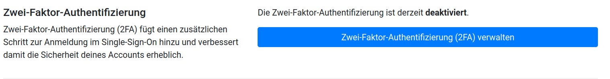
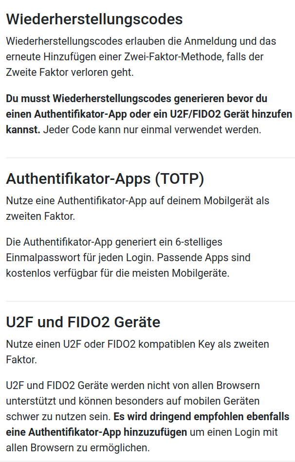
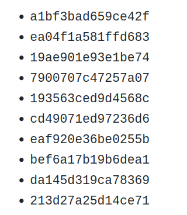
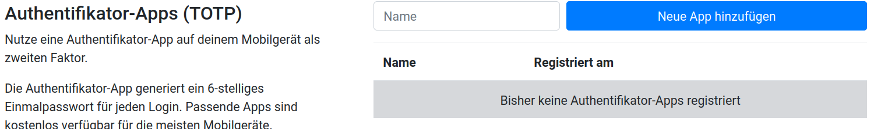
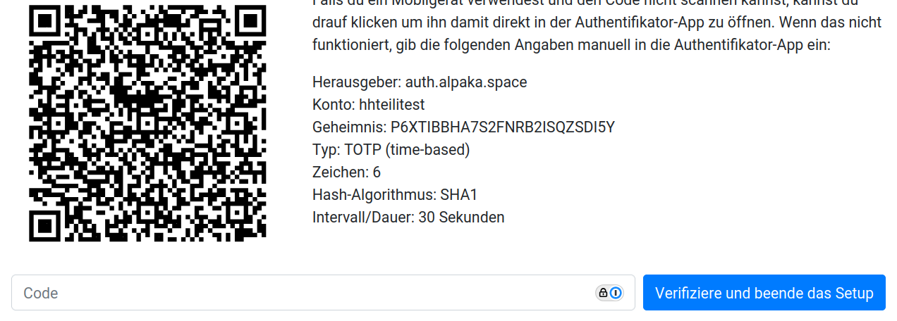
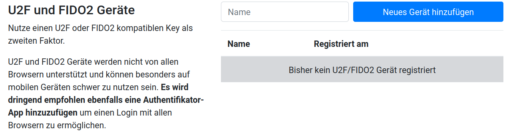

AlpakaSSO - 2FA einrichten
===

Zwei Faktor Authentifizierung (2FA) erlaubt das Einrichten von Geräten, die angeschlossen werden müssen (zB yubikey oder Biometrische Daten) oder wechselnden Einmalpasswörtern, die bei Anmeldung eingegeben werden müssen. 

Dadurch reicht Wissen über Anmeldename und Passwort nicht aus, es wird ein Zweiter Faktor benötigt...

Das aktivieren von 2FA erfolgt unter den selvservicen.

{width=300}

Dabei gibt es einen Punkt 2-FA verwalten. Dort wird auch angezeigt, ob 2FA bereits aktiviert ist. Ist es nicht aktiviert, kann es im durch den Button erreichbaren Menü aktiviert werden. 

{width=600}

Unabhängig davon, ob eine Authentificator-App oder ein U2F bzw. FIDO2 Gerät als erster Faktor hinterlegt werden soll, müssen als erstes die Wiederherstellungscodes generiert werden. 

!!! danger "Wiederherstellungscodes
    Wenn der 2-Faktor verloren geht, ist Passwort zurücksetzen keine Option um wieder zugriff auf den Account zu erhalten. Mindestens einer der Wiederherstellungscodes wird benötigt. 

{width=400}

Bei den Wiederherstellungscodes handelt es sich um 10 randomisierte Codes, diese können als Text Datei gespeichert werden (müssen nicht, einfaches auf **Weiter** klicken, lädt die Codes nicht herunter), das generieren neuer Codes überschreibt die vorherigen.

{width=200}

Anschließend gibt es mehrere Optionen den zweiten Faktor einzurichten. 

!!! note "Hinweis"
    Nicht alle Browser und gerade Mobile Endgeräte unterstützen 2Faktor Geräte. Evtl kann nur die App variante  oder FIDO2 Webauthn genutzt werden. Bitte selbstständig für eure Nutzung prüfen

## Apps

Die meisten Passwort Manager unterstützen 2FA. Ansonsten bieten Microsoft, Google, Apple und weitere, weniger große Anbieter Apps dafür an.

Dazu gebt ihr einen für euch nachvollziehbaren Namen an die Option und klickt auf neue App hinzufügen.
{width=600}
Oft kann beim Passwort Manager eintrag editieren ein QR-Code für 2FA eingescannt werden. Ist das nicht der Fall, stehen neben dem QR-Code die nötigen Daten zum Händisch eingeben. 

{width=600}

Es werden ab jetzt im 30 Sekunden Takt 6-Stellige Codes generiert. Wird der aktuelle Code im unteren Eingabefeld eingegeben, und bestätigt, steht die Funktion zur Verfügung.

## Geräte
Für Geräte wird ein nachvollziehbarer Name in das Freitextfeld gegeben. Auf betätigung des Buttons wird automatisch nach dieser Option gescannt.
{width=600}