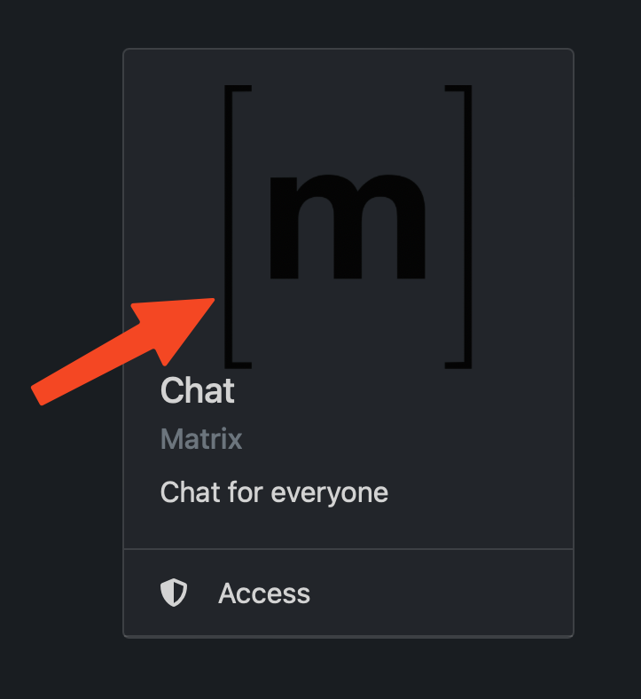
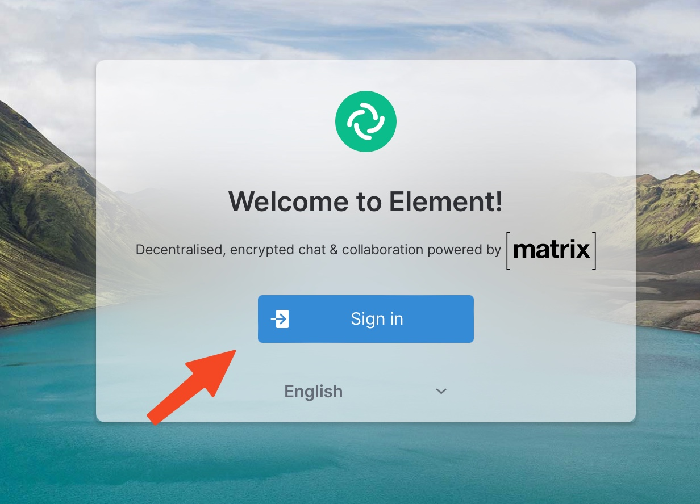
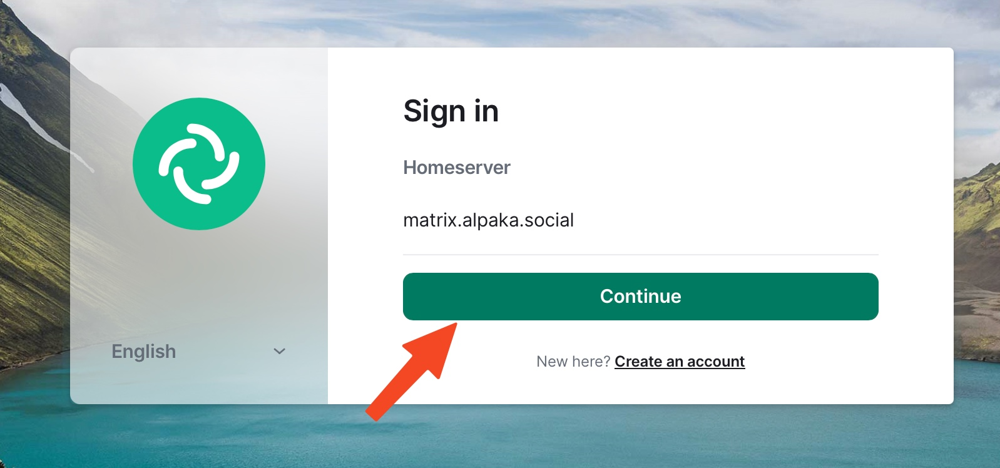
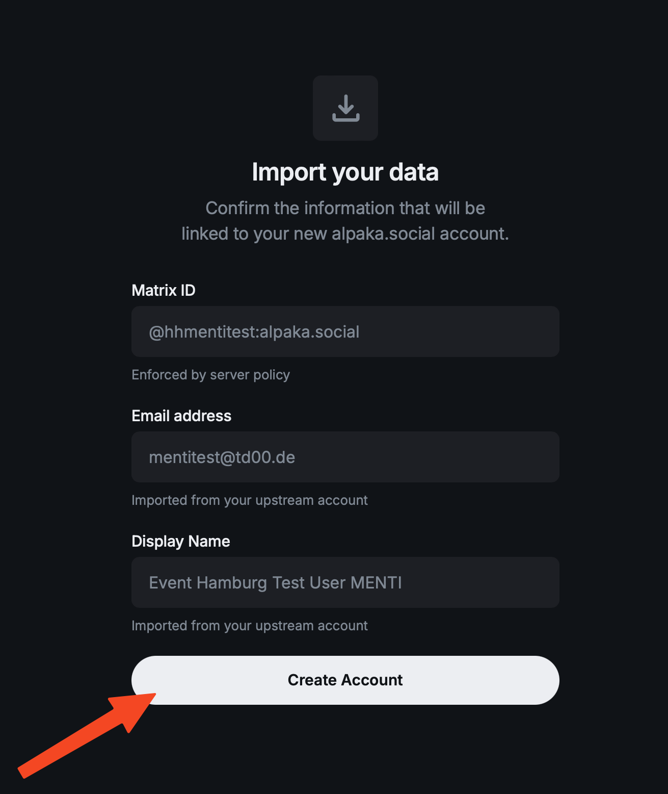
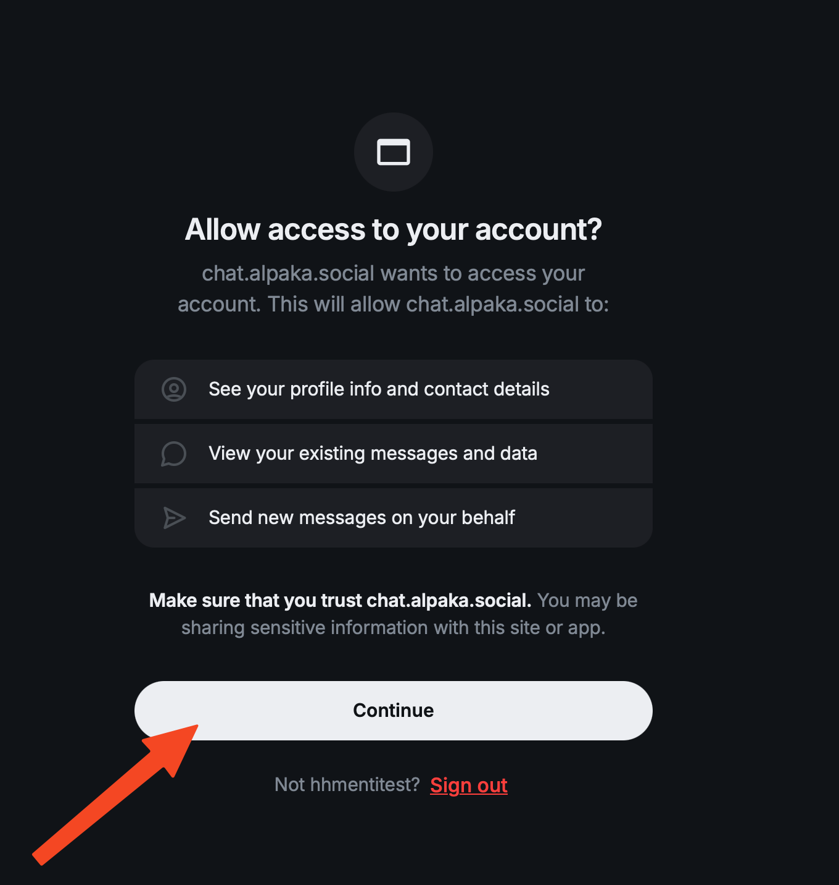

Chat / Matrix
===

!!! warning "Bereits vorhandener Matrix Account"
    Wenn du bereits einen matrix Account hast, kannst du diesen ABSOLUT benutzen um den Räumen beizutreten

Um dich bei Matrix, unserem Chat-Service außerhalb von Zulip anzumelden, wähle die Matrix kachel aus.

{width=300}

Du wirst zu Element weitergeletet. Dort klickst du auf **Sign In**

{width=600}

Falls nicht bereits *matrix.alpaka.social* als dein Homeserver eingetragen ist, trag das ein und klicke auf **Continue**

{width=600}

Überprüfe deine Daten

{width=300}

Erlaube dem Server auf dein Account zuzugreifen, ansonsten funktioniert das ganze leider nicht...

{width=300}