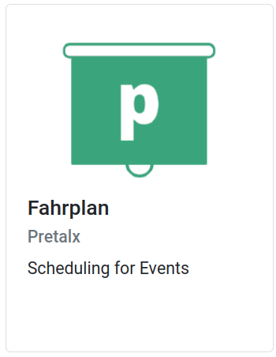
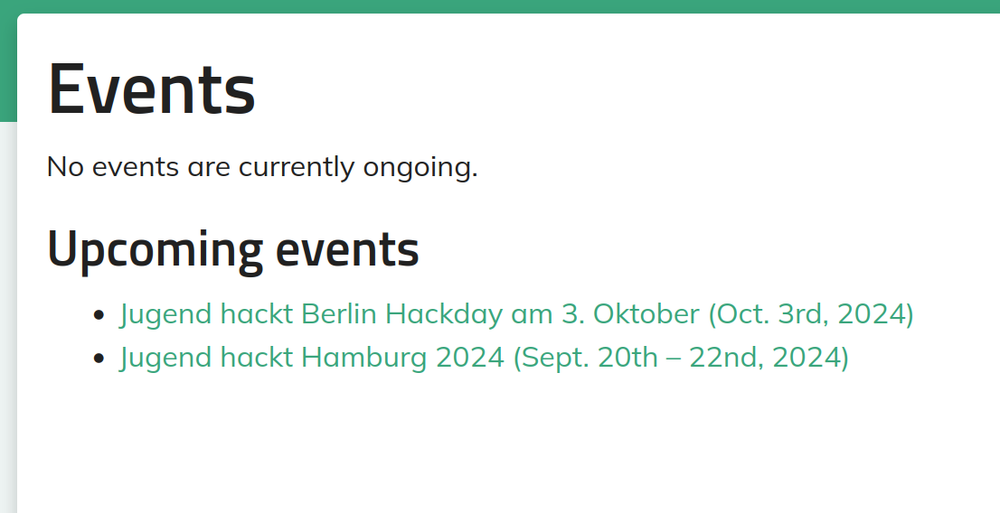
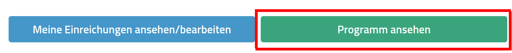
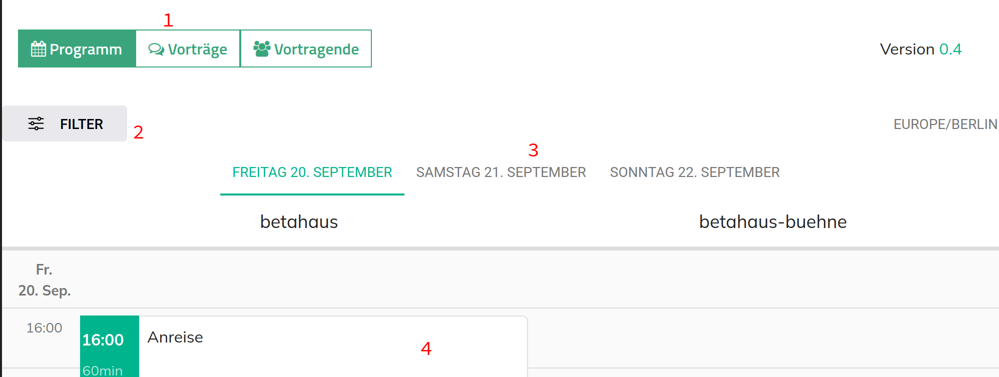

Fahrplan / Pretalx
===

Um den Fahrplan (unsere Art eines Ablaufplanes) zu erreichen, wähle die Kachel aus den Tools aus.

{width=300}

Wähle entweder unter den aktuell stattfindenden oder kommenden Events, das aus, für dass du dich interessierst.

{width=300}

Wähle aus, dass du das Programm sehen möchtest

{width=300}

In der allgemeinen Annsicht gibt es die Vorträge, nach Räumen und Zeit sortiert.

{width=300}

Es gibt verschiedene Ansichtsoptionen.

1. Wechselt zwischen alles was stattfindet untereinander (Vorträge) und nach Räumen aufgeteilt (Programm)
2. Filtermöglichkeit zwiscchen Präsentationen (zum Ende auf der Bühne) und Rahmenprogramm (alles andere)
3. Die verschiedenen Tage
4. Die Vorträge, sie sind klickbar. Dann erhälst du weitere Informationen und einen längeren Text, was stattfindet.