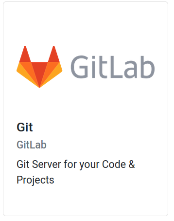
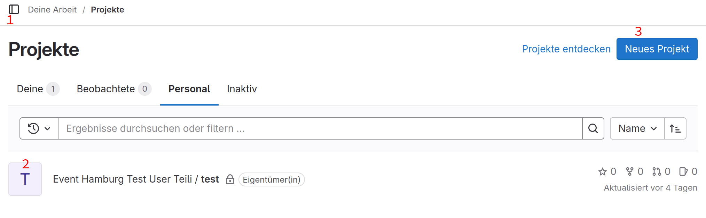
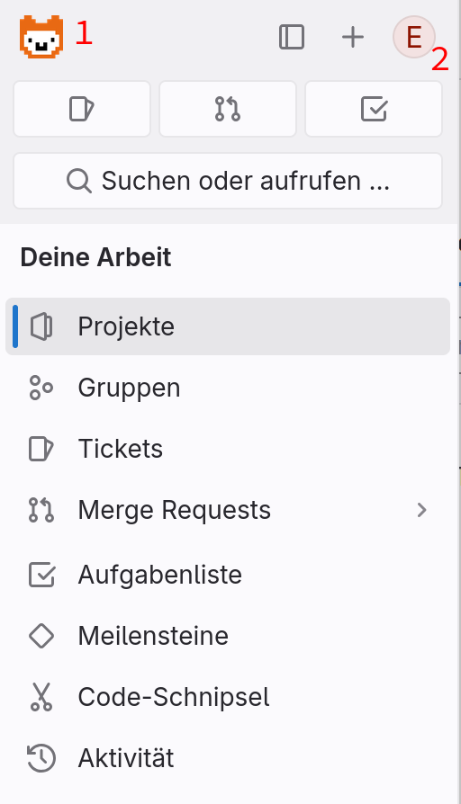
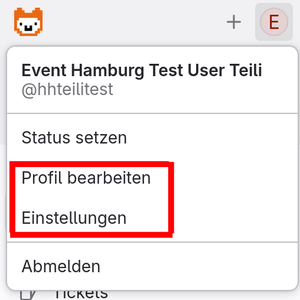
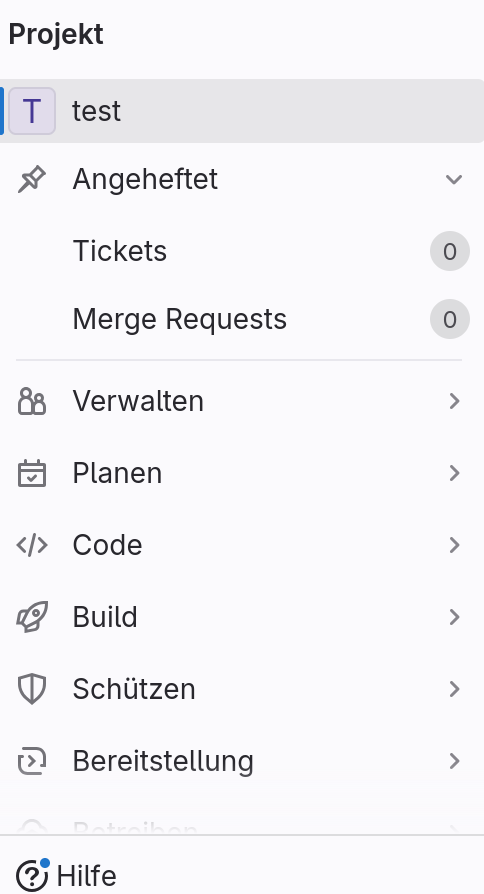

GitLab
===

Um auf dein GitLab Account zuzugreifen, wählst du von deinen Tools Git aus.

{width=300}

Das leitet dich weiter, auf die Anmeldeoberfläche des Jugend hackt GitLabs. Dort kannst du dich mit deinem SSO Account anmelden.

!!! note "Hinweis"
    öffnest du GitLab direkt und nicht aus AlpakaAuth, kann es sein, dass du beim Anmelden dein Anmeldenamen und Passwort eingeben musst. Bist du noch bei AlpakaAuth angemeldet, kommst du direkt auf die GitLab Startseite

{width=300}

Nach dem Anmelden, landest du in der Standart-Oberfläche des GitLab.

{width=300}
Die wichtigsten Funktionen sind:

1. das Seitenmenü. Von hier aus kannst du Einstellungen ändern, Projekte und Gruppen einsehen und auch die Hilfe Seite aufrufen.

2. deine Projekte. Wenn du dich das erste mal Anmeldest hast du bereits ein Projekt. Über die Zeit kommen wahrscheinlich mehr hinzu. Wenn du auf das Projekt klickst, kommst du auf die Seite des Projektes.

3. neue Projekte anlegen. Für wenn du neue Ideen hast und die Umsetzen möchstest :D.

Wenn du das Seitenmenü öffnest, stehen dir mehrere generalisierte Optionen zur Verfügung
{width=300}

1. Das Alpaka führt dich immer zurück zur Startseite!

2. Der runde Kreis stellt dein Profil dar.

!!! note "Seitenmenü"
    Je nach Bereich in dem du dich befindetst, ändern sich die Optionen, die das Seitenmenü dir bietet

### Profil
{width=300}
Wenn du auf dein Profil klickst, kannst du einen für alle Sichtbaren Status setzen, dich abmelden oder auch Einstellungen verändern. 
Wenn du auf eine der rot umrandeten Optionen klickst, verändern sich die Optionen im Seitenmenü und du kannst spezifischere Profileinstellungen vornehmen.

!!! note "sehr spezifischer Hinweis"
    Es gibt die Möglichkeit 2FA in GitLab zu benutzen. Weenn du 2FA nuzten möchtest, setze das bitte in AlpakaAuth (deinem SSO-Account), nicht in GitLab.

### Projekt
{width=300}

Befindest du dich ein einem deiner Projekte sind die Optionen des Seitenmenüs andere, als in der Standart übersicht. Hier kommst du zu den Orten um zu verwalten wer Mitmachen soll/darf, wer das Projekt sehen kann, welchen Code es bisher gibt und vieles andere

!!! note "Passwort statt shh"
    Du kannst git mit ssh nutzen. Wenn du dich damit (noch) nicht beschäftigen möchtest, steht dir auch eine (einfachere) Version mit Passwort zur Verfügung.
    Setze dafür bitte ein eigenes Passwort in GitLab ([Anleitung](/docs/tools/GitLab/password.md))