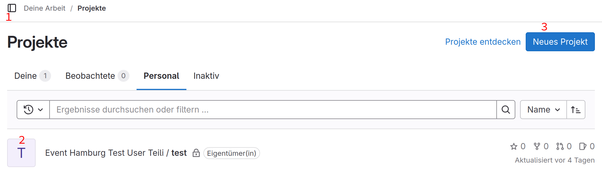

Passwort setzen
===

Um ein Passwort in GitLab zu setzen, musst du als erstes das Seitenmenü (die rote 1) öffnen.

{width=300}

Innerhalb des Seitenmenüs kannst du auf den Kreis, der dein Profil darstellen soll klicken (die rote 2). 

{width=300}

Dann öffnen sich 4 Optionen: *Status setzen*, *Profil bearbeiten*, *Einstellungen* und *Abmelden*. Es ist zum setzen des Passworts egal, ob du auf *Profil bearbeiten* oder *Einstellungen* klickst. In beiden Fällen kommst du in einem Bereich, in dem du deine persönlichen Daten ändern kannst.

{width=300}

Jetzt musst du wieder das Seitenmenü öffnen und dort Passwort auswählen.

{width=300}

Anschließend kannst du ein neues Passwort setzen, oder dein Passwort ändern.

{width=300}