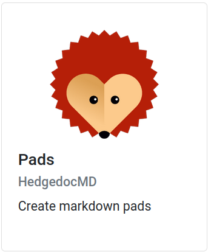
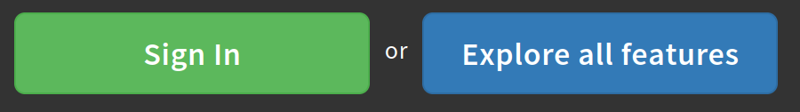
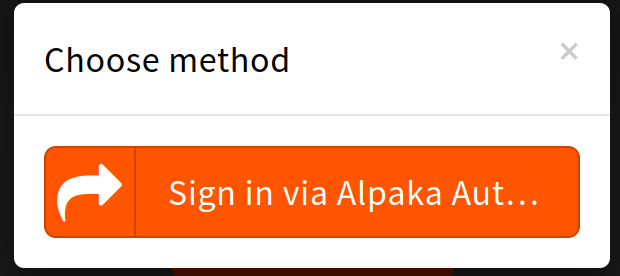
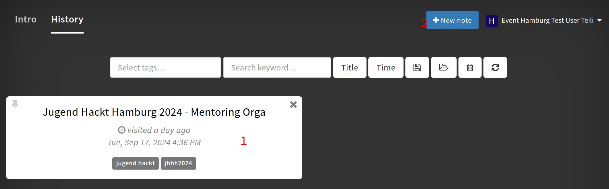
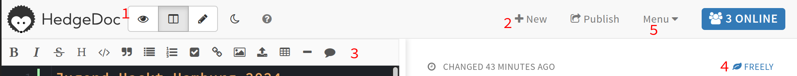

Pads / Hedgedoc
===

Unsere Pads sind ein hedgeDocMD. Das ist eine Form von Markdown Editor. Als Markdown wird die Art den Text zu formatieren bezeichnet. Diese Seite ist in Markdown geschrieben.
Der Pad Server (beziehungsweise das HedgeDocMD) ermöglicht es dir gemeinsam mit anderen an Texten zu arbeiten, oder auch von mehreren deiner Geräte aus.

Um auf dein Pad Account zuzugreifen, wählst du von deinen Tools Pad aus.

{width=300}

Das leitet dich weiter, auf die Anmeldeoberfläche des Jugend hackt Pads. Dort wählst du **Sign In** aus. Das **Explore all Features** gibt dir eine englische Anleitung.

{width=400}

Du wirst nicht direkt angemeldet, sondern musst noch einmal bestätigen, dass du dich mit dem SSO anmelden möchtest.

!!! note "Hinweis"
    öffnest du das Pad direkt und nicht aus AlpakaAuth, kann es sein, dass du beim Anmelden dein Anmeldenamen und Passwort eingeben musst. Bist du noch bei AlpakaAuth angemeldet, kommst du direkt auf die Startseite

{width=300}

Nach dem Anmelden, landest du in der Standart-Oberfläche des HedgeDocMD.

{width=700}

Die wichtigsten Ansichten dort sind:

1. Pads an denen du mitgearbeitet oder die du erstellt hast, oder auch, wie dieses Pad, dass dir zugewiesen wurde

2. die Möglichkeit ein neues Pad (ein ort zum Notizen machen) zu erstellen

Wenn du auf ein vorhandenes Pad klickst, öffnet sich dieses. Wenn du auf **+New** klickst, bekommst du ein leeres Pad. Du kannst dein Pad anderen durch die URL teilen.

{width=700}

1. Die Ansicht. Das Auge ist eine reine Lese-Ansicht, der Stift gibt dir eine Editor-Ansicht und das Doppel Panel in der Mitte gibt dir eine Ansicht, in der du links Editieren kannst udn Rechts sehen, was du schreibst.

2. Ein neues, leeres Pad erstellen.

3. Ein sogenannter *Rich-Text-Editor*. Damit kannst du dein Text zum Beispiel **fett** oder *kursiv* machen, ohne die Markdown spezifischen Befehle zu kennen. 

4. Wer darf ein Pad bearbeiten (und evtl auch sehen). Wenn du ein Pad erstellt hast, kannst du die Einstellung hier ändern.

5. alte versionen der Texte, die Möglichkeit Folien zu erstellen, oder das Pad herunter zu laden.
