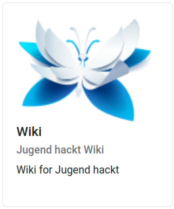
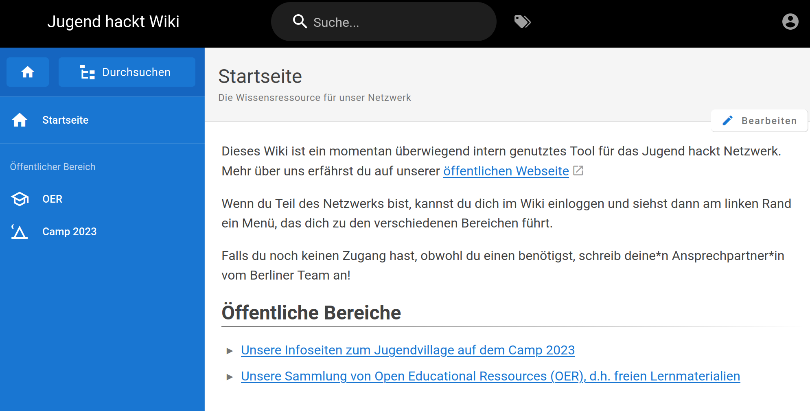
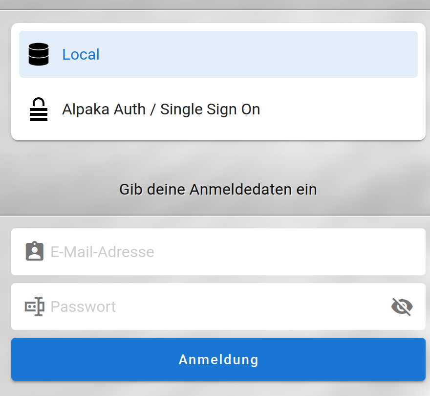

Wiki / WikiJS
===

Das Wiki dient zur Wissenssammlung, damit nicht alles immer wieder neu Zusammengetragen werden muss. 

Um auf dein Wiki Account zuzugreifen, wählst du von deinen Tools Wiki aus.
{width=300}

Du wirst auf die öffentliche Seite des Wikis weitergeleitet. Du bist noch nicht unbedingt angemeldet. Um dich anzumelden, klicke oben rechts auf den runden Kreis.
{width=700}

Auf der Anmeldesseite wählst du **Alpaka Auth / Single Sign On** aus. Der geschützte Bereich des Wikis steht dir jetzt zur Verfüng.
{width=400}